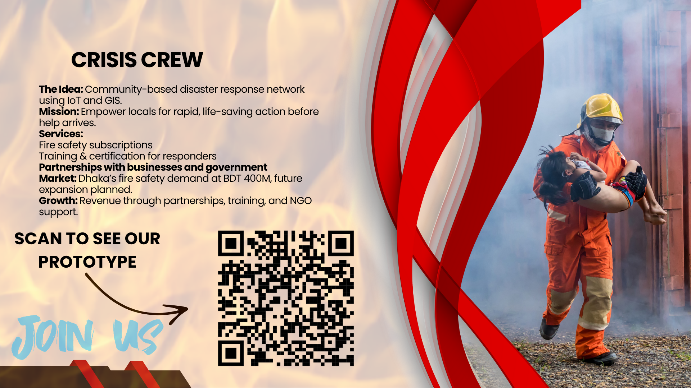

# 🌍 দুম্যগ প্রহরী -- CrisisCrew

A tech-driven social entrepreneurship solution addressing fire safety and disaster management in Bangladesh. Selected as a **Hult Prize 2025 Semi-Finalist** for its innovative approach to empowering communities and enhancing crisis response.

## 💡 Problem Statement

Fires in Bangladesh, particularly in urban centers like Dhaka, claim lives and cause significant damage due to inadequate resources, poor coordination, and limited public awareness. Between 1999 and 2020, ~285,000 fires occurred, with 2,308 deaths from 2004–2020 (Fire Service and Civil Defence). Key challenges include:

- Lack of credible information and traditional communication methods.
- Inefficient resource allocation and planning.
- Insufficient training and public awareness.
- Limited post-incident analysis.

> *Example*: The Krishi Market Fire (2023) highlighted issues like water shortages and crowd interference, underscoring the need for better coordination (Dhaka Tribune, Sep 15, 2023).

## 🌱 Our Solution

**CrisisCrew** is a proactive platform integrating **IoT**, **GIS**, and **AI** to empower trained community responders for faster, smarter fire hazard response. It addresses **Preparedness**, **Response**, **Recovery**, and **Mitigation** through:

- **Crisis Responder Dashboard**: Gamified platform with levels (Crisis Cadet to Crisis Heroes) for real-time coordination and motivation.
- **Comprehensive Training**: Online/offline workshops, VR simulations, and fire drills.
- **IoT & AI Integration**: Sensors and LLM-based chatbot provide real-time guidance and alerts.
- **Social Impact**: Empowers communities, reduces response times, and enhances safety in high-risk areas like Dhaka.
- **Innovative Element**: Offline maps, resource tracking, and adaptive AI responses for low-connectivity areas.

---

## 🎯 Target Beneficiaries

- **Corporate Sector**: High-rise offices, factories, hotels (10,000+ companies in Dhaka).
- **Residential Sector**: Apartment complexes and homes in Dhaka and Chittagong.
- **Government & Public Sector**: Schools, universities, and public institutions.
- **NGOs & International Donors**: Partners like UNDP and Bangladesh Red Crescent.

---

## 🧩 Business Model

CrisisCrew operates a **freemium social enterprise model** with multiple revenue streams:

- **Subscriptions**: Fire safety services (BDT 7,000–15,000/month for businesses, BDT 3,000/month for residential, BDT 1–2M/year for government contracts).
- **Training Programs**: Fire safety training (BDT 3,000/employee) and future flood safety training (BDT 2,000–5,000/person).
- **Partnerships**: Collaborations with government, NGOs, and educational institutions.
- **Free Tier**: Community membership, basic training, crisis alerts, and gamified dashboards for volunteers.

---

## 🔬 Research & Validation

- **Market Analysis**: Dhaka’s fire safety market is valued at BDT 400M annually, driven by urbanization and limited Fire Service coverage.
- **Competitor Analysis**: Compared against FSCD, BDPC, and private providers, CrisisCrew excels in tech-driven, community-based response.
- **Validation**: Stakeholder consultations and gap analysis in fire safety services.

📄 Reports:
- [HULT PRIZE_ Flash Nexus](https://www.canva.com/design/DAGV_iVLi8E/3x8RcpwaQ5yL7tV2uYT6xA/view?utm_content=DAGV_iVLi8E&utm_campaign=designshare&utm_medium=link2&utm_source=uniquelinks&utlId=hccff765576)
- [Project Report.pdf](docs/ProjectReport.pdf)

---

## ⚙️ Prototype

CrisisCrew’s MVP integrates:
- **Technologies**: IoT sensors, GIS-based offline maps, LLM chatbot.
- **Features**: Real-time responder dashboard, resource tracking, adaptive AI guidance, offline navigation.
- **Hosted**: [TBD - Add hosting platform, e.g., AWS, Heroku, or GitHub Pages].

🔗 [Prototype Demo](#) <!-- Replace with QR code link or live demo URL -->

📁 [Prototype Files](prototype)

---

| Name              | Role                     | Background                              |
|-------------------|--------------------------|-----------------------------------------|
| Wasfi Hassan Sefat | Chief Executive Officer  | BRAC University, BRAC Business School, 4th Year |
| Showrin Rahman    | Chief Technology Officer | BRAC University, Computer Science and Engineering, 4th Year |
| Md. Foysal        | Chief Operations Officer | BRAC University, Electrical and Electronics Engineering, 2nd Year |

## 🏆 Achievements

- 🥈 **Hult Prize 2025 Semi-Finalist**
- 🥈 **Hult Prize 2025 Semi-Finalist**

## 📸 Media Gallery

 <!-- Replace with actual screenshots or mockups -->
 <!-- Replace with actual team photo -->

